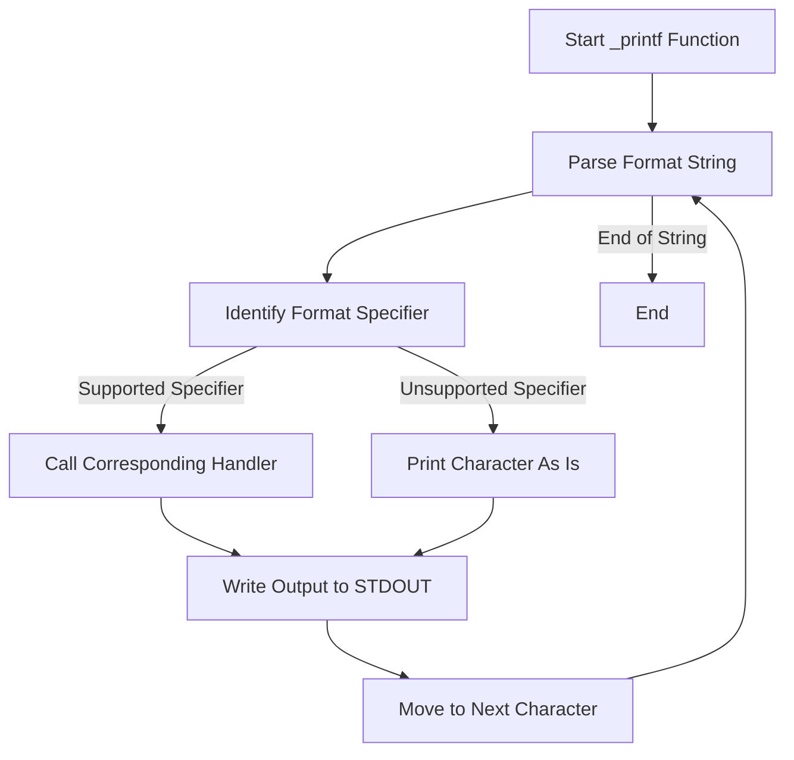

# printf

## Introduction

`printf` is a custom implementation of the C standard library function `printf`. This project demonstrates the ability to format and print data to the standard output, mimicking the behavior of the original `printf` function. It is designed for educational purposes and to deepen understanding of variadic functions, string formatting, and output handling in C.

## Features

- Supports basic conversion specifiers such as `%c`, `%s`, `%d`, `%i`, and `%b`.
- Handles variadic arguments using `stdarg.h`.
- Allows for formatted output to the standard output stream.
- Provides modular code structure for maintainability and extensibility.
- Includes helper functions for string manipulation and number conversion.

## Requirements

To build and use this project, you need:

- A C compiler such as `gcc` (supports C99 or later).
- GNU Make (optional, for using the provided Makefile).
- Unix-like environment (Linux, macOS, or WSL on Windows).

## Installation

To install and build the project, follow these steps:

1. Clone the repository:
    ```bash
    git clone https://github.com/MercyKorir/printf.git
    cd printf
    ```

2. Compile the source code using the provided Makefile:
    ```bash
    make
    ```

   This will generate an executable named `printf`.

3. Optionally, to clean build artifacts:
    ```bash
    make clean
    ```

## Usage

You can use the `printf` library in your C projects to print formatted output. Here’s a basic example:

```c
#include "main.h"

int main(void)
{
    _printf("Hello, %s! The number is: %d\n", "world", 42);
    return 0;
}
```

Compile your program with:
```bash
gcc -Wall -Werror -Wextra -pedantic main.c _printf.c -o myprogram
```

Run the executable:
```bash
./myprogram
```

### Supported Format Specifiers

- `%c`: Character
- `%s`: String
- `%d`: Signed integer (decimal)
- `%i`: Signed integer (decimal)
- `%b`: Binary (unsigned integer)

## Configuration

No special configuration is required to use the basic functionality. For advanced usage:

- To add new format specifiers, extend the handler mapping in the source code and implement the corresponding handler function.
- To change the output destination, modify the `write` function calls in the implementation to direct output elsewhere.

## License

This project is licensed under the Apache License 2.0.

```
Copyright 2024 Mercy Korir

Licensed under the Apache License, Version 2.0 (the "License");
you may not use this file except in compliance with the License.
You may obtain a copy of the License at

    http://www.apache.org/licenses/LICENSE-2.0

Unless required by applicable law or agreed to in writing, software
distributed under the License is distributed on an "AS IS" BASIS,
WITHOUT WARRANTIES OR CONDITIONS OF ANY KIND, either express or implied.
See the License for the specific language governing permissions and
limitations under the License.
```

## Contributing

Contributions are welcome! To contribute:

- Fork the repository and clone your fork.
- Create a new branch for your feature or bug fix.
- Write clear, concise commits and test your changes.
- Open a pull request describing your changes.

When contributing, please ensure:

- Code style matches the existing codebase.
- New features include relevant tests.
- Documentation is updated for any changes.

---

For questions, issues, or suggestions, please open an issue on the [GitHub repository](https://github.com/MercyKorir/printf/issues).

---

## Architecture Overview

Below is a flowchart illustrating the main process of the `_printf` function:



---

## Contact

For any further questions or direct contact, please reach out via the contact information listed in the repository profile.