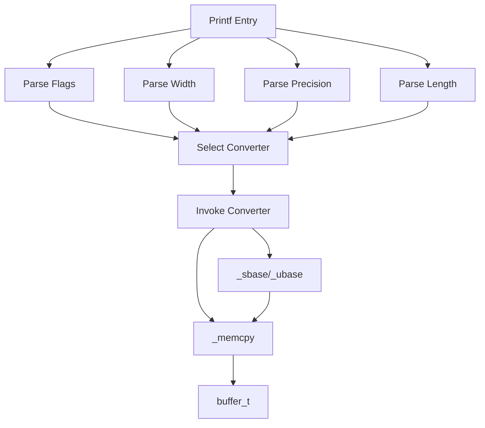

# Printf Library Documentation

This custom **Printf Library** implements a `printf`-like function in C. It supports common format specifiers, flags, width, and precision. Output is buffered and flushed to `STDOUT` efficiently.

## main.h

This header defines core macros, data structures, and function prototypes.  

- **Flag Macros**  
  - `PLUS` (1), `SPACE` (2), `HASH` (4), `ZERO` (8), `NEG` (16)  
  - Helpers: `PLUS_FLAG`, `SPACE_FLAG`, `HASH_FLAG`, `ZERO_FLAG`, `NEG_FLAG`   
- **Length Modifiers**  
  - `SHORT` (1), `LONG` (2)  
- **Data Structures**  
  - `buffer_t`: holds a character buffer, write pointer, and length  
  - `flag_t`: pairs a flag character and its value  
  - `converter_t`: maps a specifier to its handler function  
- **Function Prototypes**  
  - Core: `_printf`  
  - Handlers: `_flag`, `_width`, `_precision`, `_length`, `_specifiers`  
  - Specifiers: `_char`, `_string`, `_int`, `_bin`, `_dec`, …  
  - Helpers: `init_buffer`, `free_buffer`, `_memcpy`, `_sbase`, `_ubase`   

## helpers.c 🛠️

This module manages the **output buffer** and raw memory writes.

- **init_buffer**  
  Allocates a `buffer_t`, a 1024-byte buffer, and initializes pointers and length.  
- **_memcpy**  
  Appends `n` bytes from `src` into the buffer. Flushes to `STDOUT` when full.  
- **free_buffer**  
  Releases the underlying buffer memory and the struct itself.   

## handlers.c ⚙️

This module parses format strings and routes specifiers.

- **_flag**  
  Scans flag characters (`+`, `-`, ` `, `#`, `0`) and builds a bitmask.   
- **_width**  
  Extracts field width, handling numeric or `*`-based values from the argument list.  
- **_precision**  
  Parses precision after a `.`; supports numeric or `*`.  
- **_length**  
  Recognises `h` (SHORT) or `l` (LONG) length modifiers.  
- **_specifiers**  
  Maps conversion specifier characters to their handler functions via a `converter_t` table.  

## modifiers.c

Implements **field-width** and **precision** padding around converted data.

| Function        | Purpose                                        |
|-----------------|------------------------------------------------|
| `print_width`   | Pre-pad with spaces if width exceeds printed bytes |
| `string_width`  | Pre-pad strings based on width and precision   |
| `neg_width`     | Post-pad with spaces when left-justified (`-`) flag is set |

All padding uses `_memcpy` to write spaces. 

## base.c 🔢

Handles conversion of integers into arbitrary bases, respecting flags, width, and precision.

| Function  | Description                                | Signature                                                                                                                                     |
|-----------|--------------------------------------------|-----------------------------------------------------------------------------------------------------------------------------------------------|
| **_sbase**   | Recursively convert a **signed** integer  | `unsigned int _sbase(buffer_t *output, long int num, char *base, unsigned char flag, int width, int precision)`                              |
| **_ubase**   | Recursively convert an **unsigned** integer | `unsigned int _ubase(buffer_t *output, unsigned long int num, char *base, unsigned char flag, int width, int precision)`                     |

```c
unsigned int _sbase(buffer_t *output, long int num, char *base,
                    unsigned char flag, int width, int precision);
unsigned int _ubase(buffer_t *output, unsigned long int num, char *base,
                    unsigned char flag, int width, int precision);
```
  
### Core Logic

- Determine the **base size** by counting `base` string length.  
- **Recursive call**: if `|num| >= base size`, first convert higher-order digits.  
- **Precision padding**: insert leading zeros (`'0'`) to meet precision.  
- **Width padding**: insert spaces or zeros based on `ZERO_FLAG` and `NEG_FLAG`.  
- For `_ubase`, an optional `"0x"`/`"0X"` prefix appears when the hash flag is set.  
- Write each digit by indexing into the `base` array and calling `_memcpy`.   

Flags like `NEG_FLAG` and `ZERO_FLAG` derive from the `flag` bitmask in `main.h`. 

## converters.c

Implements basic specifiers:

- **_char**: character output (`%c`)  
- **_perc**: literal `%` (`%%`)  
- **_string**: string output (`%s`)  
- **_int**: signed decimal (`%d` / `%i`)  
- **_bin**: binary (`%b`)  

Each function:
1. Retrieves argument via `va_arg`.  
2. Applies `print_width` before output.  
3. Uses `_memcpy` or calls `_sbase`/`_ubase`.  
4. Applies `neg_width` if left-justified. 

## converters2.c

Handles numeric specifiers with alternate bases:

- **_dec**: unsigned decimal (`%u`)  
- **_oct**: octal (`%o`)  
- **lower_hex**: lowercase hex (`%x`)  
- **upper_hex**: uppercase hex (`%X`)  

Each respects the `#` (hash) flag, adding prefixes like `0`, `0x`, or `0X`. 

## converters3.c

Provides extended or custom specifiers:

- **_S**: non-printable string handling (`%S`)  
- **_p**: pointer address (`%p`)  
- **_r**: reversed string (`%r`)  
- **_R**: ROT13 encoding (`%R`)  

These handlers combine string operations with `_memcpy`, `_ubase`, and padding functions. 

---


This flowchart illustrates how `_printf` delegates parsing to handlers, selects a converter, and writes output to the buffer.