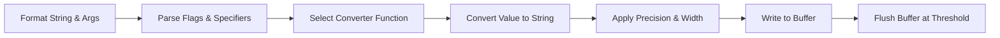

# printf Library Overview 🔧

This custom **printf** implementation provides formatted output to `stdout`. It is organized into distinct modules that handle parsing, conversion, buffering, and output. Each module interacts seamlessly to process format strings, convert arguments, apply formatting rules, and manage the output buffer.

- **Parsing & Dispatch**: `handlers.c`  
- **Data Conversion**: `base.c`, `converters.c`, `converters2.c`, `converters3.c`  
- **Formatting Modifiers**: `modifiers.c`  
- **Buffer Management**: `helpers.c`  
- **Public Interface & Types**: `main.h`  



---

## File: main.h

Defines core macros, types, and function prototypes used across the library.

**Macros for Flags & Length Modifiers**  
| Macro       | Value | Description                             |
|-------------|-------|-----------------------------------------|
| `PLUS`      | 1     | Show `+` sign for positive numbers      |
| `SPACE`     | 2     | Prefix space for positive numbers       |
| `HASH`      | 4     | Alternate form for octal/hex            |
| `ZERO`      | 8     | Pad numeric output with leading zeros   |
| `NEG`       | 16    | Left-justify within the field width     |
| `PLUS_FLAG` | –     | `(flag & PLUS)`                         |
| `SPACE_FLAG`| –     | `((flag >> 1) & 1)`                     |
| `HASH_FLAG` | –     | `((flag >> 2) & 1)`                     |
| `ZERO_FLAG` | –     | `((flag >> 3) & 1)`                     |
| `NEG_FLAG`  | –     | `((flag >> 4) & 1)`                     |

**Core Types**  
```c
typedef struct buffer_s {
    char          *buffer;  /* current write position */
    char          *start;   /* start of buffer */
    unsigned int   len;     /* bytes in buffer */
} buffer_t;

typedef struct converter_s {
    unsigned char                 spec; /* conversion specifier */
    unsigned int (*func)(va_list, buffer_t *,
                         unsigned char, int, int, unsigned char);
} converter_t;
```  


---

## File: base.c

Implements recursive base conversion for **signed** and **unsigned** integers.

- **_sbase**: Recursively convert a signed `long int` to any base.  
- **_ubase**: Recursively convert an unsigned `long` to any base, handling the `#` flag prefix.  

```c
unsigned int _ubase(buffer_t *output,
                    unsigned long num,
                    char *base,
                    unsigned char flag,
                    int width,
                    int precision);
```  
Key behaviors:  
- Calculates each digit via recursion.  
- Applies `precision` padding with `'0'`.  
- Adds base-specific prefix when `HASH_FLAG` is set.  


---

## File: modifiers.c

Handles **field width**, **precision**, and **left/right** justification.

- **print_width**: Inserts leading spaces (or zeros) before content.  
- **string_width**: Pads strings based on precision and width.  
- **neg_width**: Appends trailing spaces when left-justify (`NEG_FLAG`).  

```c
unsigned int neg_width(buffer_t *output,
                       unsigned int printed,
                       unsigned char flag,
                       int width);
```  
These functions rely on flag macros (`NEG_FLAG`, `ZERO_FLAG`) and call `_memcpy` for actual buffer writes.  


---

## File: helpers.c

Manages the output buffer in memory and flushes to `stdout` when full.

- **init_buffer**: Allocate a 1024-byte buffer.  
- **_memcpy**: Copy data into `buffer_t`, auto-flush on overflow.  
- **free_buffer**: Release buffer resources.  

```c
unsigned int _memcpy(buffer_t *output,
                     const char *src,
                     unsigned int n);
```  
🚧 The buffer is flushed via `write(1, …)` when `len == 1024`.  


---

## File: handlers.c

Parses the format string to extract flags, width, precision, length, and specifier.

1. **_flag**: Accumulates flag bits (`+`, `-`, ` `, `#`, `0`).  
2. **_length**: Detects `h` (SHORT) or `l` (LONG) length modifiers.  
3. **_width**: Parses numeric or `*` width specifiers.  
4. **_precision**: Parses precision after `.` or `*`.  
5. **_specifiers**: Maps conversion specifiers to their functions.  

```c
unsigned int (*_specifiers(const char *spec))(va_list, buffer_t *,
                                             unsigned char, int, int, unsigned char);
```  


---

## File: converters.c

Basic converters for characters, strings, signed integers, and binary.

| Specifier | Function  | Description                    |
|-----------|-----------|--------------------------------|
| `%c`      | `_char`   | Print a single character       |
| `%%`      | `_perc`   | Print a literal `%`            |
| `%s`      | `_string` | Print a C-string               |
| `%d`/`%i` | `_int`    | Print signed decimal integer   |
| `%b`      | `_bin`    | Print unsigned binary integer  |

Each calls `_memcpy`, `_sbase`/`_ubase`, and width modifiers.  


---

## File: converters2.c

Handles **unsigned** numeric conversions for decimal, octal, and hexadecimal.

| Specifier | Function     | Description                               |
|-----------|--------------|-------------------------------------------|
| `%u`      | `_dec`       | Unsigned decimal                          |
| `%o`      | `_oct`       | Unsigned octal (with `0` prefix if `#`)   |
| `%x`      | `lower_hex`  | Unsigned hex lowercase (`0x` prefix)      |
| `%X`      | `upper_hex`  | Unsigned hex uppercase (`0X` prefix)      |

### Example: `_oct`
```c
unsigned int _oct(va_list ap,
                  buffer_t *output,
                  unsigned char flag,
                  int width,
                  int precision,
                  unsigned char len)
{
    unsigned long num;
    unsigned int ret = 0;
    char zero = '0';

    /* Fetch argument with length modifier */
    if (len == LONG)    num = va_arg(ap, unsigned long);
    else                num = va_arg(ap, unsigned int);
    if (len == SHORT)   num = (unsigned short) num;

    /* Alternate form: prefix '0' */
    if (HASH_FLAG && num != 0)
        ret += _memcpy(output, &zero, 1);

    /* Convert and pad */
    if (!(num == 0 && precision == 0))
        ret += _ubase(output, num, "01234567", flag, width, precision);

    /* Trailing spaces if left-justify */
    ret += neg_width(output, ret, flag, width);
    return ret;
}
```  


---

## File: converters3.c

Special converters for pointers, non-printable characters, and string transformations.

| Specifier | Function | Description                                      |
|-----------|----------|--------------------------------------------------|
| `%p`      | `_p`      | Print pointer address in hex                     |
| `%S`      | `_S`      | Print non-printables as `\xHH`                   |
| `%r`      | `_r`      | Print string in **reverse** order                |
| `%R`      | `_R`      | Print string encoded with **ROT13** cipher       |

These extend base conversion for specialized output.  


---

```card
{
  "title": "Core Conversion",
  "content": "All converters delegate digit encoding to `_ubase`/_sbase` and handle flags, width, and precision uniformly."
}
```

---

*With these modules combined, the library supports a wide range of `printf`-style formatting features while efficiently managing output in a fixed-size buffer.*